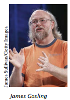

<h1 align="center"><b>BIG JAVA</b></h1>

# __1. Pengantar__

## 1.1 Program Computer

Anda mungkin pernah menggunakan komputer untuk bekerja atau bersenang-senang. Banyak orang menggunakan komputer untuk tugas sehari-hari seperti perbankan elektronik atau menulis makalah. Komputer bagus untuk tugas seperti itu. Mereka dapat menangani tugas-tugas yang berulang, seperti menjumlahkan angka atau menempatkan kata-kata di halaman, tanpa merasa bosan atau lelah.

Fleksibilitas komputer adalah fenomena yang cukup menakjubkan. Mesin yang sama dapat menyeimbangkan buku cek Anda, menyusun makalah Anda, dan bermain game. Sebaliknya, mesin lain melakukan tugas yang jauh lebih sempit; mobil drive dan pemanggang roti bersulang. Komputer dapat melakukan berbagai tugas karena mereka menjalankan program yang berbeda, yang masing-masing mengarahkan komputer untuk mengerjakan tugas tertentu.

Komputer itu sendiri adalah mesin yang menyimpan data (angka, kata, gambar), berinteraksi dengan perangkat (monitor, sound system, printer), dan menjalankan program. Sebuah __program komputer__ memberitahu komputer, secara rinci, urutan langkah-langkah yang diperlukan untuk memenuhi tugas. Komputer fisik dan perangkat periferal secara kolektif disebut __perangkat keras__. Program yang dijalankan komputer disebut __perangkat lunak__.

Program komputer saat ini sangat canggih sehingga sulit dipercaya bahwa mereka terdiri dari instruksi yang sangat primitif. Instruksi tipikal mungkin salah satu dari berikut ini:

• Letakkan titik merah pada posisi layar tertentu.

• Jumlahkan dua angka.

• Jika nilai ini negatif, lanjutkan program pada instruksi tertentu.

Pengguna komputer memiliki ilusi interaksi yang lancar karena sebuah program berisi sejumlah besar instruksi seperti itu, dan karena komputer dapat mengeksekusinya dengan kecepatan tinggi.

Tindakan merancang dan mengimplementasikan program komputer disebut __pemrograman__. Dalam buku ini, Anda akan mempelajari cara memprogram komputer yaitu, cara mengarahkan komputer untuk menjalankan tugas.

Untuk menulis permainan komputer dengan efek gerakan dan suara atau pengolah kata yang mendukung font dan gambar mewah adalah tugas yang rumit yang membutuhkan tim yang terdiri dari banyak pemrogram yang sangat terampil. Upaya pemrograman pertama Anda akan lebih biasa. Konsep dan keterampilan yang Anda pelajari dalam buku ini membentuk landasan penting, dan Anda tidak perlu kecewa jika program pertama Anda tidak menyaingi perangkat lunak canggih yang sudah Anda kenal. Sebenarnya, Anda akan menemukan bahwa ada sensasi yang luar biasa bahkan dalam tugas pemrograman sederhana. Merupakan pengalaman yang luar biasa untuk melihat komputer dengan tepat dan cepat melakukan tugas yang akan menghabiskan waktu berjam-jam untuk Anda, membuat perubahan kecil dalam program yang mengarah pada perbaikan segera, dan melihat komputer menjadi perpanjangan dari kekuatan mental Anda.

## 1.2 The Anatomy of a Computer

Untuk memahami proses pemrograman, Anda harus memiliki pemahaman dasar tentang blok bangunan yang membentuk komputer. Kami akan melihat komputer pribadi. Komputer yang lebih besar memiliki komponen yang lebih cepat, lebih besar, atau lebih kuat, tetapi pada dasarnya mereka memiliki desain yang sama.

Di jantung komputer terletak __central processing unit (CPU)__ (lihat Gambar 1). Pengkabelan bagian dalam CPU sangat rumit. Misalnya, prosesor Intel Core (CPU populer untuk komputer pribadi pada saat penulisan ini) terdiri dari beberapa ratus juta elemen struktural, yang disebut ___transistor___.

CPU melakukan kontrol program dan pemrosesan data. Artinya, CPU menempatkan dan mengeksekusi instruksi program; itu melakukan operasi aritmatika seperti penambahan, pengurangan, perkalian, dan pembagian; itu mengambil data dari memori atau perangkat eksternal dan menempatkan data yang diproses ke dalam penyimpanan.

Ada dua macam penyimpanan. Penyimpanan primer, atau memori, dibuat dari sirkuit elektronik yang dapat menyimpan data, asalkan:
disuplai dengan tenaga listrik. ___Penyimpanan sekunder___, biasanya ___hard disk___ (lihat Gambar 2) atau solid-state drive, menyediakan penyimpanan yang lebih lambat dan lebih murah yang bertahan tanpa listrik. Sebuah hard disk terdiri dari piringan berputar, yang dilapisi dengan bahan magnetik. Solid-state drive menggunakan komponen elektronik yang dapat menyimpan informasi tanpa daya, dan tanpa bagian yang bergerak.

Untuk berinteraksi dengan pengguna manusia, komputer membutuhkan perangkat periferal. Komputer mengirimkan informasi (disebut _output_) kepada pengguna melalui layar tampilan, speaker, dan printer. Pengguna dapat memasukkan informasi (disebut _input_) untuk komputer dengan menggunakan keyboard atau perangkat penunjuk seperti mouse.

_Beberapa komputer adalah unit mandiri, sedangkan yang lain saling berhubungan melalui _jaringan_. Melalui kabel jaringan, komputer dapat membaca data dan program dari lokasi penyimpanan pusat atau mengirim data ke komputer lain. Untuk pengguna komputer jaringan, bahkan mungkin tidak jelas data mana yang berada di komputer itu sendiri dan mana yang ditransmisikan melalui jaringan.

Gambar 3 memberikan gambaran skematis arsitektur komputer pribadi. Instruksi dan data program (seperti teks, angka, audio, atau video) berada di penyimpanan sekunder atau di tempat lain di jaringan. Ketika sebuah program dimulai, instruksinya dibawa ke memori, di mana CPU dapat membacanya. CPU membaca dan mengeksekusi satu instruksi pada suatu waktu. Seperti yang diarahkan oleh instruksi ini, CPU membaca data, memodifikasinya, dan menulisnya kembali ke memori atau penyimpanan sekunder. Beberapa instruksi program akan menyebabkan CPU menempatkan titik-titik pada layar tampilan atau printer atau menggetarkan speaker. Karena tindakan ini terjadi berkali-kali dan dengan kecepatan tinggi, pengguna manusia akan melihat gambar dan suara. Beberapa instruksi program membaca input pengguna dari keyboard, mouse, sensor sentuh, atau mikrofon. Program menganalisis sifat input ini dan kemudian mengeksekusi instruksi berikutnya yang sesuai.

Ketika komputer pertama kali ditemukan pada tahun 1940-an, komputer memenuhi seluruh ruangan. Foto di bawah menunjukkan ENIAC (integrator numerik elektronik dan komputer), selesai pada tahun 1946 di University of Pennsylvania. ENIAC digunakan oleh militer untuk menghitung lintasan proyektil. Saat ini, fasilitas komputasi mesin pencari, toko internet, dan jejaring sosial memenuhi gedung-gedung besar yang disebut pusat data. Di ujung lain spektrum, komputer ada di sekitar kita. Ponsel Anda memiliki komputer di dalamnya, seperti halnya banyak kartu kredit dan kartu tarif untuk angkutan umum. Mobil modern memiliki beberapa komputer––untuk mengontrol mesin, rem, lampu, dan radio.

Munculnya komputasi di mana-mana mengubah banyak aspek
hidup. Pabrik dulu mempekerjakan orang untuk melakukan tugas perakitan berulang yang saat ini dilakukan oleh robot yang dikendalikan komputer, dioperasikan oleh beberapa orang yang tahu cara bekerja dengan komputer tersebut. Buku, musik, dan film saat ini sering dikonsumsi di komputer, dan komputer hampir selalu terlibat dalam produksinya. Buku yang Anda baca sekarang tidak mungkin ditulis tanpa komputer.

Mengetahui tentang komputer dan cara memprogramnya telah menjadi keterampilan penting dalam banyak karier. Insinyur merancang mobil yang dikendalikan komputer dan peralatan medis yang melestarikan kehidupan. Ilmuwan komputer mengembangkan program yang membantu orang berkumpul untuk mendukung tujuan sosial. Misalnya, para aktivis menggunakan jejaring sosial untuk berbagi video yang menunjukkan pelecehan oleh rezim yang represif, dan informasi ini berperan penting dalam mengubah opini publik.

Ketika komputer, besar dan kecil, menjadi semakin tertanam dalam kehidupan kita sehari-hari, semakin penting bagi setiap orang untuk memahami cara kerjanya, dan cara bekerja dengannya. Saat Anda menggunakan buku ini untuk mempelajari cara memprogram komputer, Anda akan mengembangkan pemahaman yang baik tentang dasar-dasar komputasi yang akan membuat Anda menjadi warga negara yang lebih berpengetahuan dan, mungkin, seorang profesional komputasi.

## 1.3 Bahasa Pemrograman Java

Untuk menulis program komputer, Anda perlu memberikan urutan instruksi yang dapat dieksekusi oleh CPU. Sebuah program komputer terdiri dari sejumlah besar instruksi CPU sederhana, dan itu membosankan dan rawan kesalahan untuk menentukannya satu per satu. Untuk alasan itu, __bahasa pemrograman tingkat tinggi__ telah dibuat. Dalam bahasa tingkat tinggi, Anda menentukan tindakan yang harus dilakukan program Anda. __Kompiler__ menerjemahkan instruksi tingkat tinggi ke dalam instruksi yang lebih rinci (disebut __kode mesin__) yang dibutuhkan oleh CPU. Banyak bahasa pemrograman yang berbeda telah dirancang untuk tujuan yang berbeda.

Pada tahun 1991, sebuah kelompok yang dipimpin oleh James Gosling dan Patrick Naughton di Sun Microsystems merancang bahasa pemrograman, dengan nama kode "Green", untuk digunakan dalam perangkat konsumen, seperti kotak "set-top" televisi cerdas. Bahasa ini dirancang agar sederhana, aman, dan dapat digunakan untuk berbagai jenis prosesor. Tidak ada pelanggan yang pernah ditemukan untuk teknologi ini.

Gosling menceritakan bahwa pada tahun 1994 tim menyadari, “Kami dapat menulis browser yang sangat keren. Itu adalah salah satu dari sedikit hal dalam arus utama klien/server yang membutuhkan beberapa hal aneh yang telah kami lakukan: arsitektur netral, waktu nyata, andal, aman.” Java diperkenalkan kepada orang banyak yang antusias di pameran SunWorld pada tahun 1995, bersama dengan browser yang menjalankan __applet__—kode Java yang dapat ditemukan di mana saja di Internet. Gambar di sebelah kanan menunjukkan contoh khas applet.

Sejak saat itu, Jawa tumbuh dengan kecepatan yang fenomenal. Pemrogram telah menggunakan bahasa ini karena lebih mudah digunakan daripada saingan terdekatnya, C++. Selain itu, Java memiliki __perpustakaan__ yang kaya yang memungkinkan untuk menulis program portabel yang dapat melewati sistem operasi berpemilik—fitur yang sangat dicari oleh mereka yang ingin independen dari sistem berpemilik tersebut dan diperjuangkan dengan sengit oleh vendor mereka. "Edisi mikro" dan "edisi perusahaan" dari perpustakaan Java memungkinkan pemrogram Java untuk menargetkan perangkat keras mulai dari kartu pintar hingga server Internet terbesar.

Karena Java dirancang untuk Internet, ia memiliki dua atribut yang membuatnya sangat cocok untuk pemula: keamanan dan portabilitas.

| Table 1 Java Versions (since Version 1.0 in 1996) |
|:---------------------------------------------------:|

| Version | Year | Important New Features | Version | Year | Important New Features|
|:-------:|:-------:|:------------------------:|:---------:|:------:|:---------:|
 1.1 | 1997 | Inner classes | 6 | 2006 | Library improvements |
 1.2 | 1998 | Swing, Collections framework | 7 | 2011 | Small language changes and library improvements |
| 1.3 | 2000 | Performance enhancements | 8 | 2014 | Function expressions streams, new date/time library |
| 1.4 | 2002 | Assertions, XML support | 9 | 2017 | Modules |
| 5 | 2004 | Generic classes, enhanced for loop, auto-boxing, enumerations annotations | 10, 11 | 2018 | Versions with incremental improvements are released every six months |

Java dirancang agar siapa pun dapat menjalankan program di browser mereka tanpa rasa takut. Fitur keamanan bahasa Java memastikan bahwa program dihentikan jika mencoba melakukan sesuatu yang tidak aman. Memiliki lingkungan yang aman juga bermanfaat bagi siapa saja yang belajar Java. Ketika Anda membuat kesalahan yang mengakibatkan perilaku tidak aman, program Anda dihentikan dan Anda menerima laporan kesalahan yang akurat.

Manfaat lain dari Java adalah portabilitas. Program Java yang sama akan berjalan, tanpa perubahan, di Windows, UNIX, Linux, atau Macintosh. Untuk mencapai portabilitas, kompiler Java tidak menerjemahkan program Java secara langsung ke dalam instruksi CPU. Sebaliknya, program Java yang dikompilasi berisi instruksi untuk _mesin virtual_ Java, sebuah program yang mensimulasikan CPU nyata. Portabilitas adalah manfaat lain bagi siswa pemula. Anda tidak perlu belajar bagaimana menulis program untuk platform yang berbeda.

Saat ini, Java telah ditetapkan sebagai salah satu bahasa yang paling penting untuk pemrograman tujuan umum serta untuk instruksi ilmu komputer. Namun, meskipun Java adalah bahasa yang baik untuk pemula, itu tidak sempurna, karena tiga alasan.

Karena Java tidak dirancang khusus untuk siswa, tidak ada pemikiran yang diberikan untuk membuatnya sangat sederhana untuk menulis program dasar. Sejumlah mesin teknis diperlukan untuk menulis bahkan program yang paling sederhana. Ini bukan masalah bagi programmer profesional, tetapi bisa menjadi gangguan bagi siswa pemula. Saat Anda mempelajari cara memprogram di Java, akan ada saatnya Anda akan diminta untuk puas dengan penjelasan awal dan menunggu detail yang lebih lengkap di bab selanjutnya.

Java telah diperpanjang berkali-kali selama masa pakainya—lihat Tabel 1. Dalam buku ini, kami berasumsi bahwa Anda memiliki Java versi 8 atau yang lebih baru.

Akhirnya, Anda tidak dapat berharap untuk mempelajari semua bahasa Jawa dalam satu kursus. Bahasa Java itu sendiri relatif sederhana, tetapi Java berisi sekumpulan besar paket perpustakaan yang diperlukan untuk menulis program yang berguna. Ada paket untuk grafik, desain antarmuka pengguna, kriptografi, jaringan, suara, penyimpanan basis data, dan banyak tujuan lainnya. Bahkan
programmer Java ahli tidak dapat berharap untuk mengetahui isi dari semua paket yang mereka gunakan hanya yang mereka butuhkan untuk proyek tertentu.

Dengan menggunakan buku ini, Anda diharapkan untuk belajar banyak tentang bahasa Java dan tentang paket-paket yang paling penting. Ingatlah bahwa tujuan utama dari buku ini bukanlah untuk membuat Anda menghafal hal-hal kecil Java, tetapi untuk mengajari Anda cara berpikir tentang pemrograman.