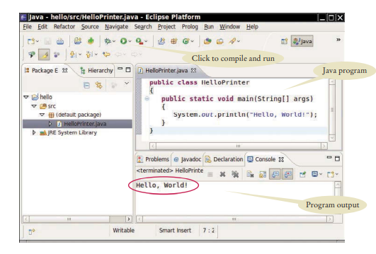

<h1 align="center"><b>BIG JAVA</b></h1>

# __1. Pengantar__

## __1.1 Program Computer__

Anda mungkin pernah menggunakan komputer untuk bekerja atau bersenang-senang. Banyak orang menggunakan komputer untuk tugas sehari-hari seperti perbankan elektronik atau menulis makalah. Komputer bagus untuk tugas seperti itu. Mereka dapat menangani tugas-tugas yang berulang, seperti menjumlahkan angka atau menempatkan kata-kata di halaman, tanpa merasa bosan atau lelah.

Fleksibilitas komputer adalah fenomena yang cukup menakjubkan. Mesin yang sama dapat menyeimbangkan buku cek Anda, menyusun makalah Anda, dan bermain game. Sebaliknya, mesin lain melakukan tugas yang jauh lebih sempit; mobil drive dan pemanggang roti bersulang. Komputer dapat melakukan berbagai tugas karena mereka menjalankan program yang berbeda, yang masing-masing mengarahkan komputer untuk mengerjakan tugas tertentu.

Komputer itu sendiri adalah mesin yang menyimpan data (angka, kata, gambar), berinteraksi dengan perangkat (monitor, sound system, printer), dan menjalankan program. Sebuah __program komputer__ memberitahu komputer, secara rinci, urutan langkah-langkah yang diperlukan untuk memenuhi tugas. Komputer fisik dan perangkat periferal secara kolektif disebut __perangkat keras__. Program yang dijalankan komputer disebut __perangkat lunak__.

Program komputer saat ini sangat canggih sehingga sulit dipercaya bahwa mereka terdiri dari instruksi yang sangat primitif. Instruksi tipikal mungkin salah satu dari berikut ini:

• Letakkan titik merah pada posisi layar tertentu.

• Jumlahkan dua angka.

• Jika nilai ini negatif, lanjutkan program pada instruksi tertentu.

Pengguna komputer memiliki ilusi interaksi yang lancar karena sebuah program berisi sejumlah besar instruksi seperti itu, dan karena komputer dapat mengeksekusinya dengan kecepatan tinggi.

Tindakan merancang dan mengimplementasikan program komputer disebut __pemrograman__. Dalam buku ini, Anda akan mempelajari cara memprogram komputer yaitu, cara mengarahkan komputer untuk menjalankan tugas.

Untuk menulis permainan komputer dengan efek gerakan dan suara atau pengolah kata yang mendukung font dan gambar mewah adalah tugas yang rumit yang membutuhkan tim yang terdiri dari banyak pemrogram yang sangat terampil. Upaya pemrograman pertama Anda akan lebih biasa. Konsep dan keterampilan yang Anda pelajari dalam buku ini membentuk landasan penting, dan Anda tidak perlu kecewa jika program pertama Anda tidak menyaingi perangkat lunak canggih yang sudah Anda kenal. Sebenarnya, Anda akan menemukan bahwa ada sensasi yang luar biasa bahkan dalam tugas pemrograman sederhana. Merupakan pengalaman yang luar biasa untuk melihat komputer dengan tepat dan cepat melakukan tugas yang akan menghabiskan waktu berjam-jam untuk Anda, membuat perubahan kecil dalam program yang mengarah pada perbaikan segera, dan melihat komputer menjadi perpanjangan dari kekuatan mental Anda.

## __1.2 The Anatomy of a Computer__

Untuk memahami proses pemrograman, Anda harus memiliki pemahaman dasar tentang blok bangunan yang membentuk komputer. Kami akan melihat komputer pribadi. Komputer yang lebih besar memiliki komponen yang lebih cepat, lebih besar, atau lebih kuat, tetapi pada dasarnya mereka memiliki desain yang sama.

Di jantung komputer terletak __central processing unit (CPU)__ (lihat Gambar 1). Pengkabelan bagian dalam CPU sangat rumit. Misalnya, prosesor Intel Core (CPU populer untuk komputer pribadi pada saat penulisan ini) terdiri dari beberapa ratus juta elemen struktural, yang disebut ___transistor___.

<p align="center"></p>

CPU melakukan kontrol program dan pemrosesan data. Artinya, CPU menempatkan dan mengeksekusi instruksi program; itu melakukan operasi aritmatika seperti penambahan, pengurangan, perkalian, dan pembagian; itu mengambil data dari memori atau perangkat eksternal dan menempatkan data yang diproses ke dalam penyimpanan.

Ada dua macam penyimpanan. Penyimpanan primer, atau memori, dibuat dari sirkuit elektronik yang dapat menyimpan data, asalkan:
disuplai dengan tenaga listrik. ___Penyimpanan sekunder___, biasanya ___hard disk___ (lihat Gambar 2) atau solid-state drive, menyediakan penyimpanan yang lebih lambat dan lebih murah yang bertahan tanpa listrik. Sebuah hard disk terdiri dari piringan berputar, yang dilapisi dengan bahan magnetik. Solid-state drive menggunakan komponen elektronik yang dapat menyimpan informasi tanpa daya, dan tanpa bagian yang bergerak.

<p align="center"></p>

Untuk berinteraksi dengan pengguna manusia, komputer membutuhkan perangkat periferal. Komputer mengirimkan informasi (disebut _output_) kepada pengguna melalui layar tampilan, speaker, dan printer. Pengguna dapat memasukkan informasi (disebut _input_) untuk komputer dengan menggunakan keyboard atau perangkat penunjuk seperti mouse.

_Beberapa komputer adalah unit mandiri, sedangkan yang lain saling berhubungan melalui _jaringan_. Melalui kabel jaringan, komputer dapat membaca data dan program dari lokasi penyimpanan pusat atau mengirim data ke komputer lain. Untuk pengguna komputer jaringan, bahkan mungkin tidak jelas data mana yang berada di komputer itu sendiri dan mana yang ditransmisikan melalui jaringan.

Gambar 3 memberikan gambaran skematis arsitektur komputer pribadi. Instruksi dan data program (seperti teks, angka, audio, atau video) berada di penyimpanan sekunder atau di tempat lain di jaringan. Ketika sebuah program dimulai, instruksinya dibawa ke memori, di mana CPU dapat membacanya. CPU membaca dan mengeksekusi satu instruksi pada suatu waktu. Seperti yang diarahkan oleh instruksi ini, CPU membaca data, memodifikasinya, dan menulisnya kembali ke memori atau penyimpanan sekunder. Beberapa instruksi program akan menyebabkan CPU menempatkan titik-titik pada layar tampilan atau printer atau menggetarkan speaker. Karena tindakan ini terjadi berkali-kali dan dengan kecepatan tinggi, pengguna manusia akan melihat gambar dan suara. Beberapa instruksi program membaca input pengguna dari keyboard, mouse, sensor sentuh, atau mikrofon. Program menganalisis sifat input ini dan kemudian mengeksekusi instruksi berikutnya yang sesuai.

<p align="center"></p>

Ketika komputer pertama kali ditemukan pada tahun 1940-an, komputer memenuhi seluruh ruangan. Foto di bawah menunjukkan ENIAC (integrator numerik elektronik dan komputer), selesai pada tahun 1946 di University of Pennsylvania. ENIAC digunakan oleh militer untuk menghitung lintasan proyektil. Saat ini, fasilitas komputasi mesin pencari, toko internet, dan jejaring sosial memenuhi gedung-gedung besar yang disebut pusat data. Di ujung lain spektrum, komputer ada di sekitar kita. Ponsel Anda memiliki komputer di dalamnya, seperti halnya banyak kartu kredit dan kartu tarif untuk angkutan umum. Mobil modern memiliki beberapa komputer––untuk mengontrol mesin, rem, lampu, dan radio.

Munculnya komputasi di mana-mana mengubah banyak aspek
hidup. Pabrik dulu mempekerjakan orang untuk melakukan tugas perakitan berulang yang saat ini dilakukan oleh robot yang dikendalikan komputer, dioperasikan oleh beberapa orang yang tahu cara bekerja dengan komputer tersebut. Buku, musik, dan film saat ini sering dikonsumsi di komputer, dan komputer hampir selalu terlibat dalam produksinya. Buku yang Anda baca sekarang tidak mungkin ditulis tanpa komputer.

<p align="center"></p>

Mengetahui tentang komputer dan cara memprogramnya telah menjadi keterampilan penting dalam banyak karier. Insinyur merancang mobil yang dikendalikan komputer dan peralatan medis yang melestarikan kehidupan. Ilmuwan komputer mengembangkan program yang membantu orang berkumpul untuk mendukung tujuan sosial. Misalnya, para aktivis menggunakan jejaring sosial untuk berbagi video yang menunjukkan pelecehan oleh rezim yang represif, dan informasi ini berperan penting dalam mengubah opini publik.

Ketika komputer, besar dan kecil, menjadi semakin tertanam dalam kehidupan kita sehari-hari, semakin penting bagi setiap orang untuk memahami cara kerjanya, dan cara bekerja dengannya. Saat Anda menggunakan buku ini untuk mempelajari cara memprogram komputer, Anda akan mengembangkan pemahaman yang baik tentang dasar-dasar komputasi yang akan membuat Anda menjadi warga negara yang lebih berpengetahuan dan, mungkin, seorang profesional komputasi.

<p align="center"></p>

## __1.3 Bahasa Pemrograman Java__

Untuk menulis program komputer, Anda perlu memberikan urutan instruksi yang dapat dieksekusi oleh CPU. Sebuah program komputer terdiri dari sejumlah besar instruksi CPU sederhana, dan itu membosankan dan rawan kesalahan untuk menentukannya satu per satu. Untuk alasan itu, __bahasa pemrograman tingkat tinggi__ telah dibuat. Dalam bahasa tingkat tinggi, Anda menentukan tindakan yang harus dilakukan program Anda. __Kompiler__ menerjemahkan instruksi tingkat tinggi ke dalam instruksi yang lebih rinci (disebut __kode mesin__) yang dibutuhkan oleh CPU. Banyak bahasa pemrograman yang berbeda telah dirancang untuk tujuan yang berbeda.

<p align="center"></p>

Pada tahun 1991, sebuah kelompok yang dipimpin oleh James Gosling dan Patrick Naughton di Sun Microsystems merancang bahasa pemrograman, dengan nama kode "Green", untuk digunakan dalam perangkat konsumen, seperti kotak "set-top" televisi cerdas. Bahasa ini dirancang agar sederhana, aman, dan dapat digunakan untuk berbagai jenis prosesor. Tidak ada pelanggan yang pernah ditemukan untuk teknologi ini.

Gosling menceritakan bahwa pada tahun 1994 tim menyadari, “Kami dapat menulis browser yang sangat keren. Itu adalah salah satu dari sedikit hal dalam arus utama klien/server yang membutuhkan beberapa hal aneh yang telah kami lakukan: arsitektur netral, waktu nyata, andal, aman.” Java diperkenalkan kepada orang banyak yang antusias di pameran SunWorld pada tahun 1995, bersama dengan browser yang menjalankan __applet__—kode Java yang dapat ditemukan di mana saja di Internet. Gambar di sebelah kanan menunjukkan contoh khas applet.

<p align="center"></p>

Sejak saat itu, Jawa tumbuh dengan kecepatan yang fenomenal. Pemrogram telah menggunakan bahasa ini karena lebih mudah digunakan daripada saingan terdekatnya, C++. Selain itu, Java memiliki __perpustakaan__ yang kaya yang memungkinkan untuk menulis program portabel yang dapat melewati sistem operasi berpemilik—fitur yang sangat dicari oleh mereka yang ingin independen dari sistem berpemilik tersebut dan diperjuangkan dengan sengit oleh vendor mereka. "Edisi mikro" dan "edisi perusahaan" dari perpustakaan Java memungkinkan pemrogram Java untuk menargetkan perangkat keras mulai dari kartu pintar hingga server Internet terbesar.

Karena Java dirancang untuk Internet, ia memiliki dua atribut yang membuatnya sangat cocok untuk pemula: keamanan dan portabilitas.

| Table 1 Java Versions (since Version 1.0 in 1996) |
|:---------------------------------------------------:|

| Version | Year | Important New Features | Version | Year | Important New Features|
|:-------:|:-------:|:------------------------:|:---------:|:------:|:---------:|
 1.1 | 1997 | Inner classes | 6 | 2006 | Library improvements |
 1.2 | 1998 | Swing, Collections framework | 7 | 2011 | Small language changes and library improvements |
| 1.3 | 2000 | Performance enhancements | 8 | 2014 | Function expressions streams, new date/time library |
| 1.4 | 2002 | Assertions, XML support | 9 | 2017 | Modules |
| 5 | 2004 | Generic classes, enhanced for loop, auto-boxing, enumerations annotations | 10, 11 | 2018 | Versions with incremental improvements are released every six months |

Java dirancang agar siapa pun dapat menjalankan program di browser mereka tanpa rasa takut. Fitur keamanan bahasa Java memastikan bahwa program dihentikan jika mencoba melakukan sesuatu yang tidak aman. Memiliki lingkungan yang aman juga bermanfaat bagi siapa saja yang belajar Java. Ketika Anda membuat kesalahan yang mengakibatkan perilaku tidak aman, program Anda dihentikan dan Anda menerima laporan kesalahan yang akurat.

Manfaat lain dari Java adalah portabilitas. Program Java yang sama akan berjalan, tanpa perubahan, di Windows, UNIX, Linux, atau Macintosh. Untuk mencapai portabilitas, kompiler Java tidak menerjemahkan program Java secara langsung ke dalam instruksi CPU. Sebaliknya, program Java yang dikompilasi berisi instruksi untuk _mesin virtual_ Java, sebuah program yang mensimulasikan CPU nyata. Portabilitas adalah manfaat lain bagi siswa pemula. Anda tidak perlu belajar bagaimana menulis program untuk platform yang berbeda.

Saat ini, Java telah ditetapkan sebagai salah satu bahasa yang paling penting untuk pemrograman tujuan umum serta untuk instruksi ilmu komputer. Namun, meskipun Java adalah bahasa yang baik untuk pemula, itu tidak sempurna, karena tiga alasan.

Karena Java tidak dirancang khusus untuk siswa, tidak ada pemikiran yang diberikan untuk membuatnya sangat sederhana untuk menulis program dasar. Sejumlah mesin teknis diperlukan untuk menulis bahkan program yang paling sederhana. Ini bukan masalah bagi programmer profesional, tetapi bisa menjadi gangguan bagi siswa pemula. Saat Anda mempelajari cara memprogram di Java, akan ada saatnya Anda akan diminta untuk puas dengan penjelasan awal dan menunggu detail yang lebih lengkap di bab selanjutnya.

Java telah diperpanjang berkali-kali selama masa pakainya—lihat Tabel 1. Dalam buku ini, kami berasumsi bahwa Anda memiliki Java versi 8 atau yang lebih baru.

Akhirnya, Anda tidak dapat berharap untuk mempelajari semua bahasa Jawa dalam satu kursus. Bahasa Java itu sendiri relatif sederhana, tetapi Java berisi sekumpulan besar paket perpustakaan yang diperlukan untuk menulis program yang berguna. Ada paket untuk grafik, desain antarmuka pengguna, kriptografi, jaringan, suara, penyimpanan basis data, dan banyak tujuan lainnya. Bahkan
programmer Java ahli tidak dapat berharap untuk mengetahui isi dari semua paket yang mereka gunakan hanya yang mereka butuhkan untuk proyek tertentu.

Dengan menggunakan buku ini, Anda diharapkan untuk belajar banyak tentang bahasa Java dan tentang paket-paket yang paling penting. Ingatlah bahwa tujuan utama dari buku ini bukanlah untuk membuat Anda menghafal hal-hal kecil Java, tetapi untuk mengajari Anda cara berpikir tentang pemrograman.

## __1.4 Menjadi Familiar dengan Lingkungan Pemrograman Anda__

Banyak siswa menemukan bahwa alat yang mereka butuhkan sebagai pemrogram sangat berbeda dari perangkat lunak yang mereka kenal. Anda harus meluangkan waktu untuk membiasakan diri dengan lingkungan pemrograman Anda. Karena sistem komputer sangat bervariasi, buku ini hanya dapat memberikan garis besar langkah-langkah yang perlu Anda ikuti. Merupakan ide bagus untuk berpartisipasi dalam lab praktik, atau meminta teman yang berpengetahuan luas untuk memberi Anda tur.

<p align="center"></p>

Langkah 1 Mulai lingkungan pengembangan Java. 

Sistem komputer sangat berbeda dalam hal ini. Pada banyak komputer terdapat lingkungan pengembangan terintegrasi di mana Anda dapat menulis dan menguji program Anda.

Di komputer lain Anda pertama kali meluncurkan editor, sebuah program yang berfungsi seperti pengolah kata, di mana Anda dapat memasukkan instruksi Java Anda; Anda kemudian membuka jendela konsol dan ketik perintah untuk menjalankan program Anda. Anda perlu mencari tahu bagaimana memulai dengan lingkungan Anda.

Langkah 2 Tulis program sederhana.

Pilihan tradisional untuk program pertama dalam bahasa pemrograman baru adalah program yang menampilkan sapaan sederhana: “Halo, Dunia!”. Mari kita ikuti tradisi itu. Inilah "Halo, Dunia!" program di Java:


```java

public class HelloPrinter 
{ 
    public static void main(String[] args) 
    { 
        System.out.println("Hello, World!"); 
    } 
}

```

Kami akan memeriksa program ini di bagian selanjutnya.

Apa pun lingkungan pemrograman yang Anda gunakan, Anda memulai aktivitas Anda dengan mengetikkan pernyataan program ke dalam jendela editor.

Buat file baru dan beri nama HelloPrinter.java, menggunakan langkah-langkah yang sesuai untuk lingkungan Anda. (Jika lingkungan Anda mengharuskan Anda memberikan nama proyek selain nama file, gunakan nama halo untuk proyek tersebut.) Masukkan instruksi program persis seperti yang diberikan di atas. Atau, temukan salinan elektronik dalam kode pendamping buku ini dan tempelkan ke editor Anda.

<p align="center"></p>

Saat Anda menulis program ini, perhatikan baik-baik berbagai simbol, dan ingatlah bahwa Java peka huruf besar-kecil. Anda harus memasukkan huruf besar dan kecil persis seperti yang muncul dalam daftar program. Anda tidak dapat mengetik MAIN atau PrintLn. Jika Anda tidak hati-hati, Anda akan mengalami masalah—lihat Kesalahan Umum 1.2._

Langkah 3 Jalankan program

Proses untuk menjalankan program sangat bergantung pada lingkungan pemrograman Anda. Anda mungkin harus mengklik tombol atau memasukkan beberapa perintah. Saat Anda menjalankan program pengujian, pesannya

```java
Hello, World!
```

akan muncul di suatu tempat di layar (lihat Gambar 4 dan Gambar 5).

Untuk menjalankan program Anda, kompiler Java menerjemahkan file sumber Anda (yaitu, pernyataan yang Anda tulis) ke dalam file kelas. (Sebuah file kelas berisi instruksi untuk mesin virtual Java.) Setelah kompilator menerjemahkan kode sumber Anda ke dalam instruksi mesin virtual, mesin virtual akan mengeksekusinya. Selama eksekusi,
mesin virtual mengakses perpustakaan kode pra-tertulis, termasuk implementasi kelas System dan PrintStream yang diperlukan untuk menampilkan output program. Gambar 6 merangkum proses membuat dan menjalankan program Java. Di beberapa lingkungan pemrograman, kompilator dan mesin virtual pada dasarnya tidak terlihat oleh pemrogram—mereka dijalankan secara otomatis setiap kali Anda meminta untuk menjalankan program Java. Di lingkungan lain, Anda perlu meluncurkan kompiler dan mesin virtual secara eksplisit.

Langkah 4 Atur pekerjaan Anda.

Sebagai seorang programmer, Anda menulis program, mencobanya, dan memperbaikinya. Anda menyimpan program Anda dalam file. File disimpan dalam folder atau direktori. Sebuah folder dapat berisi file serta folder lain, yang dengan sendirinya dapat berisi lebih banyak file dan folder (lihat Gambar 7). Hirarki ini bisa sangat besar, dan Anda tidak perlu khawatir dengan semua cabangnya. Namun, Anda harus membuat folder untuk mengatur pekerjaan Anda. Sebaiknya buat folder terpisah untuk kursus pemrograman Anda. Di dalam folder itu, buat folder terpisah untuk setiap program.

<p align="center"></p>

Beberapa lingkungan pemrograman menempatkan program Anda ke lokasi default jika Anda tidak menentukan folder sendiri. Dalam hal ini, Anda perlu mencari tahu di mana file-file itu berada.

Pastikan Anda memahami di mana file Anda berada dalam hierarki folder. Informasi ini penting saat Anda mengirimkan file untuk penilaian, dan untuk membuat salinan cadangan (lihat Tip Pemrograman 1.1).

__Tip Pemrograman 1.1___

__Salinan Cadangan__

Anda akan menghabiskan banyak waktu untuk membuat dan meningkatkan program Java. Sangat mudah untuk menghapus file secara tidak sengaja, dan terkadang file hilang karena kerusakan komputer. Mengetik ulang konten file yang hilang membuat frustrasi dan memakan waktu. Oleh karena itu, sangatlah penting bagi Anda untuk mempelajari cara mengamankan file dan membiasakan diri melakukannya sebelum bencana terjadi. Mencadangkan file pada stik memori adalah metode penyimpanan yang mudah dan nyaman bagi banyak orang. Bentuk cadangan lain yang semakin populer adalah penyimpanan file Internet.

Berikut adalah beberapa petunjuk yang perlu diingat:

- Sering-seringlah membuat cadangan. Mencadangkan file hanya membutuhkan beberapa detik, dan Anda akan membenci diri sendiri jika harus menghabiskan banyak waktu untuk membuat ulang pekerjaan yang sebenarnya bisa Anda simpan dengan mudah. Saya sarankan Anda mencadangkan pekerjaan Anda setiap tiga puluh menit sekali.

- Putar cadangan. Gunakan lebih dari satu direktori untuk cadangan, dan putar mereka. Artinya, backup dulu ke direktori pertama. Kemudian kembali ke direktori kedua. Kemudian gunakan yang ketiga, lalu kembali ke yang pertama. Dengan begitu Anda selalu memiliki tiga cadangan terbaru. Jika perubahan terbaru Anda memperburuk keadaan, Anda dapat kembali ke versi yang lebih lama.

- Perhatikan arah pencadangan. Pencadangan melibatkan penyalinan file dari satu tempat ke tempat lain. Anda harus melakukannya dengan benar—yaitu, menyalin dari lokasi kerja Anda ke lokasi pencadangan. Jika Anda melakukannya dengan cara yang salah, Anda akan menimpa file yang lebih baru dengan versi yang lebih lama.

- Periksa cadangan Anda sesekali. Periksa kembali apakah cadangan Anda berada di tempat yang Anda pikirkan. Tidak ada yang lebih membuat frustrasi daripada mengetahui bahwa cadangan tidak ada saat Anda membutuhkannya.

- Santai, lalu pulihkan. Saat Anda kehilangan file dan perlu memulihkannya dari cadangan, kemungkinan besar Anda berada dalam keadaan gelisah dan tidak bahagia. Ambil napas dalam-dalam dan pikirkan proses pemulihan sebelum Anda mulai. Bukan hal yang aneh bagi pengguna komputer yang gelisah untuk menghapus cadangan terakhir ketika mencoba memulihkan file yang rusak.

## 1.5 Menganalisis Program Pertama Anda

Pada bagian ini, kita akan menganalisis program Java pertama secara rinci. Di sini lagi adalah kode sumber.

<p align="center"></p>

Garis

```java
public class HelloPrinter
```

menunjukkan deklarasi kelas yang disebut HelloPrinter.

Setiap program Java terdiri dari satu atau lebih kelas. Kami akan membahas kelas secara lebih rinci di Bab 2 dan 3.

Kata publik menunjukkan bahwa kelas dapat digunakan oleh "publik". Anda kemudian akan menemukan fitur pribadi.

Di Java, setiap file sumber dapat berisi paling banyak satu kelas publik, dan nama kelas publik harus sesuai dengan nama file yang berisi kelas tersebut. Misalnya, kelas HelloPrinter harus dimuat dalam file bernama HelloPrinter.java.

``` java
The construction

Konstruksi

public static void main(String[] args) 
{ 
. . . 
}

```

mendeklarasikan metode yang disebut main. Metode berisi kumpulan instruksi pemrograman yang menjelaskan bagaimana melakukan tugas tertentu.

Setiap aplikasi Java harus memiliki metode utama. Sebagian besar program Java berisi metode lain selain utama, dan Anda akan melihat di Bab 3 cara menulis metode lain.

Istilah statis dijelaskan secara lebih rinci dalam Bab 8, dan arti dari String[ ] args dibahas dalam Bab 11. Pada saat ini, cukup pertimbangkan

``` java

public class ClassName 
{ 
    public static void main(String[] args) 
    { 
        . . . 
    } 
} 

```

sebagai bagian dari "pipa" yang diperlukan untuk membuat program Java. Program pertama kami memiliki semua instruksi di dalam metode utama kelas.

Metode utama berisi satu atau lebih instruksi yang disebut pernyataan. Setiap pernyataan diakhiri dengan titik koma (;). Ketika sebuah program dijalankan, pernyataan dalam metode utama dieksekusi satu per satu.

<p align="center"></p>

Dalam program contoh kami, metode utama memiliki satu pernyataan:

```java
System.out.println("Hello, World!");
```

Pernyataan ini mencetak sebaris teks, yaitu “Halo, Dunia!”. Dalam pernyataan ini, kami memanggil metode yang, untuk alasan yang tidak akan kami jelaskan di sini, ditentukan dengan nama System.out.println yang agak panjang.

Kita tidak harus mengimplementasikan metode ini—programmer yang menulis library Java sudah melakukannya untuk kita. Kami hanya ingin metode melakukan tugas yang dimaksudkan, yaitu mencetak nilai.

Setiap kali Anda memanggil metode di Java, Anda perlu menentukan

1. Metode yang ingin Anda gunakan (dalam hal ini, System.out.println).

2.Nilai apa pun yang dibutuhkan metode untuk menjalankan tugasnya (dalam hal ini, "Halo, Dunia!"). Istilah teknis untuk nilai seperti itu adalah argumen. Argumen diapit dalam tanda kurung. Beberapa argumen dipisahkan dengan koma.

Urutan karakter yang diapit tanda kutip

```java
"Hello, World!" 
```

disebut string. Anda harus menyertakan isi string di dalam tanda kutip sehingga kompilator mengetahui maksud Anda secara harfiah "Halo, Dunia!". Ada alasan untuk persyaratan ini. Misalkan Anda perlu mencetak kata main. Dengan melampirkannya dalam tanda kutip, "utama", kompiler tahu maksud Anda urutan karakter m a i n,
bukan metode bernama main. Aturannya sederhana, Anda harus menyertakan semua string teks dalam tanda kutip, sehingga kompilator menganggapnya sebagai teks biasa dan tidak mencoba menafsirkannya sebagai instruksi program.

Anda juga dapat mencetak nilai numerik. Misalnya pernyataan

```java
System.out.println(3 + 4);
```

mengevaluasi ekspresi 3 + 4 dan menampilkan angka 7.

Sintaks 1.1 Program Java

Metode `System.out.println` mencetak string atau angka dan kemudian memulai baris baru. Misalnya, urutan pernyataan

``` java

System.out.println("Hello"); 
System.out.println("World!");

```

mencetak dua baris teks:

``` java

Hello 
World!

```

Ada metode kedua, System.out.print, yang dapat Anda gunakan untuk mencetak item tanpa memulai baris baru. Misalnya, output dari dua pernyataan

```java

System.out.print("00"); 
System.out.println(3 + 4);

```

adalah garis tunggal

```java

007

```

CONTOH KODE Lihat sec05 dari eText atau kode pendamping untuk program yang mendemonstrasikan perintah cetak.

Kesalahan Umum 1.1

Menghilangkan Titik Koma

Di Java setiap pernyataan harus diakhiri dengan titik koma. Lupa mengetik titik koma adalah kesalahan umum. Ini membingungkan kompiler, karena kompiler menggunakan titik koma untuk menemukan di mana satu pernyataan berakhir dan yang berikutnya dimulai. Kompilator tidak menggunakan jeda baris atau kurung kurawal untuk mengenali akhir pernyataan. Misalnya, kompiler menganggap

```java

System.out.println("Hello") 
System.out.println("World!");

```

satu pernyataan, seolah-olah Anda telah menulis

```java

System.out.println("Hello") System.out.println("World!");

```


Kemudian tidak mengerti pernyataan itu, karena tidak mengharapkan kata Sistem mengikuti kurung penutup setelah "Halo"

Obatnya sederhana. Pindai setiap pernyataan untuk mencari titik koma, sama seperti Anda akan memeriksa bahwa setiap kalimat bahasa Inggris diakhiri dengan tanda titik. Namun, jangan menambahkan titik koma di akhir public class Hello atau public static void main. Garis-garis ini bukan pernyataan.

## __1.6  Errors__

Bereksperimenlah sedikit dengan program HelloPrinter. Apa yang terjadi jika Anda membuat kesalahan pengetikan seperti

```java

System.ou.println("Hello, World!"); 
System.out.println("Hello, Word!");

```

Dalam kasus pertama, kompiler akan mengeluh. Ini akan mengatakan bahwa ia tidak tahu apa yang Anda maksud dengan ou. Kata-kata yang tepat dari pesan kesalahan tergantung pada lingkungan pengembangan Anda, tetapi mungkin seperti "Tidak dapat menemukan simbol ou". Ini adalah kesalahan waktu kompilasi. Ada yang salah menurut aturan bahasa dan kompiler menemukannya. Untuk alasan ini, kesalahan waktu kompilasi sering disebut kesalahan sintaksis. Ketika kompilator menemukan satu atau lebih kesalahan, ia menolak untuk menerjemahkan program ke dalam instruksi mesin virtual Java, dan sebagai konsekuensinya Anda tidak memiliki program yang dapat dijalankan. Anda harus memperbaiki kesalahan dan mengkompilasi lagi. Faktanya, kompilator cukup pilih-pilih, dan adalah umum untuk melewati beberapa putaran memperbaiki kesalahan waktu kompilasi sebelum kompilasi berhasil untuk pertama kalinya.

Jika kompiler menemukan kesalahan, itu tidak akan berhenti dan menyerah begitu saja. Ini akan mencoba melaporkan kesalahan sebanyak yang dapat ditemukan, sehingga Anda dapat memperbaiki semuanya sekaligus.

Terkadang, kesalahan membuat kompiler keluar jalur. Misalkan, misalnya, Anda lupa tanda kutip di sekitar string: System.out.println(Hello, World!). Kompiler tidak akan mengeluh tentang tanda kutip yang hilang. Sebagai gantinya, itu akan melaporkan "Tidak dapat menemukan simbol Halo". Sayangnya, kompilernya tidak terlalu pintar dan tidak menyadari bahwa Anda bermaksud menggunakan string. Terserah Anda untuk menyadari bahwa Anda perlu menyertakan string dalam tanda kutip.

Kesalahan pada baris kedua di atas adalah jenis yang berbeda. Program akan dikompilasi dan dijalankan, tetapi outputnya akan salah. Ini akan mencetak

```java

Hello, Word!

```

Ini adalah kesalahan run-time. Program ini secara sintaksis benar dan melakukan sesuatu, tetapi tidak melakukan apa yang seharusnya dilakukan. Karena kesalahan run-time disebabkan oleh kelemahan logis dalam program, mereka sering disebut kesalahan logika.

Kesalahan run-time khusus ini tidak menyertakan pesan kesalahan. Itu hanya menghasilkan output yang salah. Beberapa jenis kesalahan run-time sangat parah sehingga menghasilkan pengecualian: pesan kesalahan dari mesin virtual Java. Misalnya, jika program Anda menyertakan pernyataan

```java

System.out.println(1 / 0);

```

Anda akan mendapatkan pesan kesalahan run-time "Pembagian dengan nol".

Selama pengembangan program, kesalahan tidak dapat dihindari. Begitu sebuah program lebih panjang dari beberapa baris, itu akan membutuhkan konsentrasi manusia super untuk memasukkannya dengan benar tanpa tergelincir satu kali pun. Anda akan menemukan diri Anda menghilangkan titik koma atau tanda kutip lebih sering daripada yang Anda inginkan, tetapi kompilator akan melacak masalah ini untuk Anda.

Kesalahan run-time lebih merepotkan. Kompilator tidak akan menemukannya—sebenarnya, kompilator akan dengan senang hati menerjemahkan program apa pun selama sintaksnya benar—tetapi program yang dihasilkan akan melakukan kesalahan. Ini adalah tanggung jawab pembuat program untuk menguji program dan menemukan kesalahan run-time.

CONTOH KODE Lihat sec06 dari eText atau kode pendamping untuk tiga program yang menggambarkan kesalahan.

__Kesalahan Umum 1.2__

__Kata-kata yang salah eja__

Jika Anda secara tidak sengaja salah mengeja kata, maka hal-hal aneh mungkin terjadi, dan mungkin tidak selalu jelas dari pesan kesalahan apa yang salah. Berikut adalah contoh yang baik tentang bagaimana kesalahan ejaan sederhana dapat menyebabkan masalah:

```java

public class HelloPrinter 
    { 
    public static void Main(String[] args) 
    { 
        System.out.println("Hello, World!"); 
    } 
}

```

Kelas ini mendeklarasikan sebuah metode yang disebut Main. Kompiler tidak akan menganggap ini sama dengan metode utama, karena Main dimulai dengan huruf besar dan bahasa Java peka huruf besar/kecil. Huruf besar dan kecil dianggap benar-benar berbeda satu sama lain, dan bagi kompiler Main tidak lebih cocok untuk main daripada hujan. Kompiler akan dengan senang hati mengkompilasi metode Main Anda, tetapi ketika mesin virtual Java membaca file yang dikompilasi, ia akan mengeluh tentang metode utama yang hilang dan menolak untuk menjalankan program. Tentu saja, pesan "metode utama yang hilang" akan memberi Anda petunjuk di mana mencari kesalahan.

If you get an error message that seems to indicate that the compiler or virtual machine is on 
the wrong track, check for spelling and capitalization. If you misspell the name of a symbol 
(for example, ou instead of out), the compiler will produce a message such as “cannot find sym
bol ou”. That error message is usually a good clue that you made a spelling error.

_Jika Anda mendapatkan pesan kesalahan yang tampaknya menunjukkan bahwa kompiler atau mesin virtual berada di jalur yang salah, periksa ejaan dan kapitalisasi. Jika Anda salah mengeja nama simbol (misalnya, ou alih-alih keluar), kompilator akan menghasilkan pesan seperti "tidak dapat menemukan sym bol ou". Pesan kesalahan itu biasanya merupakan petunjuk bagus bahwa Anda membuat kesalahan ejaan._

## __1.7 Pemecahan Masalah: Desain Algoritma__

Anda akan segera belajar bagaimana memprogram perhitungan dan pengambilan keputusan di Java. Tetapi sebelum kita melihat mekanisme penerapan perhitungan di bab berikutnya, mari kita pertimbangkan bagaimana Anda dapat menjelaskan langkah-langkah yang diperlukan untuk menemukan solusi dari suatu masalah.

### __1.7.1 Konsep Algoritma__

Anda mungkin telah menemukan iklan yang mendorong Anda untuk membayar layanan terkomputerisasi mencocokkan Anda dengan pasangan cinta. Memikirkan bagaimana ini bisa berhasil. Anda mengisi formulir dan kirimkan. Yang lain melakukan hal yang sama. Data diproses oleh program komputer. Apakah masuk akal untuk asumsikan bahwa komputer dapat melakukan tugasmenemukan pasangan terbaik untuk Anda? Misalkan Anda adik laki-laki, bukan komputer, memiliki semua formulir di mejanya. Instruksi apa yang bisa Anda berikan? memberinya? Anda tidak bisa mengatakan, “Temukan yang paling tampan orang yang suka inline skating dan browsing internet”. Tidak ada standar objektif untuk ketampanan, dan pendapat saudaramu (atau itu program komputer yang menganalisis foto calon mitra) kemungkinan akan berbeda dari milik Anda. Jika Anda tidak dapat memberikan instruksi tertulis kepada seseorang untuk menyelesaikannya masalah, tidak mungkin komputer secara ajaib dapat menemukan solusi yang tepat. Itu komputer hanya dapat melakukan apa yang Anda perintahkan. Itu hanya melakukannya lebih cepat, tanpa mendapatkan bosan atau lelah.

Oleh karena itu, layanan pembuatan jodoh yang terkomputerisasi tidak dapat menjamin untuk menemukanpasangan yang optimal untuk Anda. Sebagai gantinya, Anda mungkin disajikan dengan serangkaian calon mitra yang memiliki minat yang sama dengan Anda. Itu adalah tugas yang program computer dapat memecahkan.

Agar program komputer memberikan jawaban atas masalah yang menghitung

jawaban, itu harus mengikuti urutan langkah-langkah yang

- Jelas

- Dapat dijalankan

- Mengakhiri

Urutan langkah tidak ambigu ketika ada instruksi yang tepat tentang apa yang harus dilakukan pada setiap langkah dan kemana harus pergi selanjutnya. Tidak ada ruang untuk menebak atau pendapat pribadi. Sebuah langkah dapat dieksekusi ketika itu dapat dilaksanakan dalam praktek. Misalnya, komputer dapat mencantumkan semua orang yang memiliki hobi yang sama dengan Anda, tapi itu tidak bisa memprediksi siapa yang akan menjadi pasangan seumur hidup Anda. Akhirnya, urutan langkah berakhir jika pada akhirnya akan berakhir. Sebuah program yang terus bekerja tanpa memberikan jawaban adalah jelas tidak berguna.

Urutan langkah yang tidak ambigu, dapat dieksekusi, dan diakhiri disebut algoritma. Meskipun tidak ada algoritme untuk menemukan pasangan, banyak masalah memiliki algoritme untuk diselesaikan mereka. Bagian berikutnya memberikan contoh. 

### __1.7.2 Algoritma untuk Memecahkan Masalah Investasi__

Pertimbangkan masalah investasi berikut:

Anda memasukkan $10.000 ke dalam rekening bank yang menghasilkan bunga 5 persen per tahun. Berapa banyak tahun yang diperlukan agar saldo akun menjadi dua kali lipat dari aslinya?

Bisakah Anda memecahkan masalah ini dengan tangan? Tentu, Anda bisa. Anda mengetahui keseimbangannya sebagai berikut:

<p align="center"></p>

Anda terus berjalan sampai saldo setidaknya $20.000. Kemudian angka terakhir di tahun inikolom adalah jawabannya.

Tentu saja, melakukan perhitungan ini sangat membosankan bagi Anda atau adik laki-laki Anda. Tetapi komputer sangat pandai melakukan perhitungan berulang dengan cepat dan tanpa cacat. Yang penting bagi komputer adalah deskripsi langkah-langkah untuk menemukan solusi. Setiap langkah harus jelas dan tidak ambigu, tidak memerlukan tebak-tebakan. Berikut adalah deskripsi seperti itu:

Setel tahun ke 0, saldo ke 10.000.

<p align="center"></p>

Ketika saldo kurang dari $20,000

- Tambahkan 1 ke tabel tahun.

- Tetapkan bunga ke saldo x 0,05 (yaitu, bunga 5 persen).

- Tambahkan bunga ke saldo

<p align="center"></p>

Laporan tahun sebagai jawabannya.

Langkah-langkah ini termasuk dalam bahasa yang belum dapat dipahami oleh komputer, tapi kamu akan segera belajar bagaimana merumuskannya dalam Java. Deskripsi ini disebut dengan pseudocode. Kami membahas aturan untuk menulis pseudocode di bagian selanjutnya.

### __1.7.3 Pseudocode__

Tidak ada persyaratan ketat untuk pseudocode karena dibaca oleh manusia,bukan program komputer. Berikut adalah jenis-jenis pernyataan pseudocode dan bagaimana kita akan menggunakan penerapannya dalam buku ini:

- Gunakan pernyataan seperti berikut ini untuk menjelaskan bagaimana suatu nilai ditetapkan atau diubah:
    - biaya total = harga beli + biaya operasi
    - Kalikan nilai saldo dengan 1,05.
    - Hapus karakter pertama dan terakhir dari kata.

- Jelaskan keputusan dan pengulangan sebagai berikut:
    - Jika total biaya 1 < total biaya 2
    - Ketika saldo kurang dari $20,000
    - Untuk setiap gambar dalam urutan
    
    Gunakan lekukan untuk menunjukkan pernyataan mana yang harus dipilih atau diulang:

    Untuk setiap mobil
    - biaya operasi = 10 x biaya bahan bakar tahunan
    - biaya total = harga beli + biaya operasi

Di sini, lekukan menunjukkan bahwa kedua pernyataan harus dieksekusi untuk setiap mobil.

- Tunjukkan hasil dengan pernyataan seperti:
    - Pilih mobil1.
    - Laporkan tahun sebagai jawabannya.

### __1.7.4 Dari Algoritma ke Program__

Di Bagian 1.7.2, kami mengembangkan pseudocode untuk menemukan berapa lama waktu yang dibutuhkan untuk menggandakan investasi. Mari kita periksa kembali bahwa pseudocode mewakili suatu algoritma itu . adalah bahwa pseudocode itu jelas, dapat dieksekusi, dan diakhiri.

Pseudocode kami jelas. Ini hanya memberi tahu cara memperbarui nilai di setiap langkah. Pseudocode dapat dieksekusi karena kami menggunakan tingkat bunga tetap. Apakah kami mengatakan untuk menggunakan tingkat bunga aktual yang akan dibebankan di tahun-tahun mendatang, dan bukan tingkat bunga tetap 5 persen per tahun, instruksi tidak akan dapat dieksekusi. Tidak ada jalan bagi siapa pun untuk mengetahui berapa tingkat bunga di masa depan. Ini membutuhkan sedikit berpikir untuk melihat bahwa langkah-langkahnya berakhir: Dengan setiap langkah, keseimbangan naik setidaknya $500, jadi akhirnya harus mencapai $20.000.

Oleh karena itu, kami telah menemukan algoritme untuk menyelesaikan masalah investasi kami, dan kami tahu kami dapat menemukan solusinya dengan memprogram komputer. Keberadaan algoritma adalah prasyarat penting untuk memprogram tugas. Anda harus terlebih dahulu algoritma untuk tugas anda sebelum Anda memulai pemrograman (lihat Angka 8). Dalam bab-bab berikutnya, Anda akan mempelajari cara mengekspresikan algoritme dalam bahasa Java.

### ___Menjelaskan algoritma dengan Pseudocode___

Ini adalah yang pertama dari banyak cara bagian dalam buku ini yang memberikan Anda langkah-demi-langkah prosedur untuk melaksanakan tugas-tugas penting dalam mengembangkan program komputer.

Sebelum Anda siap untuk menulis sebuah program di Java, Anda perlu mengembangkan metode algorithma untuk tiba di solusi untuk masalah tertentu menggambarkan algoritma di pseudocode urutan langkah-langkah yang tepat dirumuskan dalam bahasa Inggris untuk menggambarkan, kami akan merancang sebuah algoritma untuk masalah ini:

__Pernyataan masalah__ Anda memiliki pilihan untuk membeli salah satu dari dua mobil. Satu lebih hemat bahan bakar daripada yang lain, tetapi juga lebih mahal. 

Anda tahu harga dan efisiensi bahan bakar (dalam mil per galon, mpg) dari kedua mobil. Anda berencana untuk menyimpan mobil selama sepuluh tahun. Asumsikan harga $4 per galon gas dan penggunaan 15.000 mil per tahun. Anda akan membayar tunai untuk mobil dan tidak khawatir tentang biaya pembiayaan. Mobil mana yang lebih baik?

__Langkah 1__	Tentukan input dan output. 

Dalam contoh soal kami, kami memiliki input ini:

- Harga beli1 dan efisiensi bahan bakar1, harga dan efisiensi bahan bakar (dalam mpg) mobil pertama.

- Harga beli2 dan efisiensi bahan bakar2, harga dan efisiensi bahan bakar mobil kedua.

Kami hanya ingin tahu mobil mana yang lebih baik dibeli. Itu adalah keluaran (output) yang diinginkan.

__Langkah 2__ Memecah masalah menjadi tugas-tugas yang lebih kecil. 

Untuk setiap mobil, kita perlu mengetahui total biaya mengemudinya. Mari kita lakukan perhitungan ini secara terpisah untuk setiap mobil. Setelah kita memiliki total biaya untuk setiap mobil, kita dapat memutuskan mobil mana yang lebih baik.

Total biaya untuk setiap mobil adalah ___harga beli + biaya operasional___.

Kami mengasumsikan penggunaan konstan dan harga gas selama sepuluh tahun, sehingga biaya operasi tergantung pada biaya mengemudi mobil selama satu tahun.

> Biaya operasi adalah ___10 x biaya bahan bakar tahunan___.

> Biaya bahan bakar tahunan adalah ___harga per galon x bahan bakar tahunan yang dikonsumsi___.

Bahan bakar tahunan yang dikonsumsi adalah ___jarak tempuh tahunan / efisiensi bahan bakar___. Misalnya, jika Anda mengendarai mobil sejauh 15.000 mil dan efisiensi bahan bakarnya 15 mil/galon, mobil tersebut mengkonsumsi 1.000 galon.

__Langkah 3__  Jelaskan setiap subtugas dalam pseudocode. 

Dalam uraian Anda, atur langkah-langkahnya sehingga setiap nilai antara dihitung sebelum diperlukan dalam perhitungan lain. Misalnya, daftar langkah:

> ___biaya total = harga pembelian + biaya operasi___

Setelah Anda menghitung __biaya operasi__. 

Berikut adalah algoritma untuk memutuskan mobilmana yang akan dibeli:

Untuk setiap mobil, hitung total biaya sebagai berikut: 

- konsumsi bahan bakar tahunan = jarak tempuh tahunan / efisiensi bahan bakar 

- biaya bahan bakar tahunan = harga per galon x konsumsi bahan bakar tahunan 

- biaya operasional = 10 x biaya bahan bakar tahunan 

- total biaya = harga beli + biaya operasional 

Jika total biaya mobil1 < total biaya mobil2

- Pilih mobil1. 

Lainnya

- Pilih mobil2.

__Langkah 4__ Uji pseudocode Anda dengan mengerjakan soal.

Kami akan menggunakan nilai sampel ini: 

- Mobil 1: $25.000, 50 mil/galon 

- Mobil 2: $20.000, 30 mil/galon 

Berikut adalah perhitungan biaya mobil pertama:

> ___konsumsi bahan bakar tahunan = jarak tempuh tahunan / efisiensi bahan bakar = 15000 / 50 = 300___

> ___biaya bahan bakar tahunan = harga per galon x konsumsi bahan bakar tahunan = 4 x 300 = 1200___

> ___biaya operasi = 10 x biaya bahan bakar tahunan = 10 x 1200 = 12000___ 

> ___total biaya = harga pembelian + biaya operasi = 25000 + 12000 = 37000___ 

Demikian pula, total biaya untuk mobil kedua adalah $ 40.000. Oleh karena itu, keluaran dari algoritma adalah memilih mobil 1.

Contoh Kerja berikut menunjukkan bagaimana menggunakan konsep-konsep dalam bab ini dan langkah-langkah dalam Cara untuk memecahkan masalah lain. Dalam hal ini, Anda akan melihat bagaimana mengembangkan algoritme untuk meletakkan ubin dalam pola warna yang bergantian. Anda harus membaca Contoh yang Dikerjakan untuk meninjau apa yang telah Anda pelajari, dan untuk bantuan dalam mengatasi masalah lain.

Di bab-bab selanjutnya, contoh yang dikerjakan ditunjukkan dengan deskripsi singkat tentang masalah yang ditangani dalam contoh, ditambah pengingat untuk melihatnya di eTeks Anda atau mengunduhnya dari situs web pendamping buku di _www.wiley.com/go/bjeo7._ Anda akan menemukan kode apa pun yang terkait dengan Contoh yang Dikerjakan yang disertakan dengan kode pendamping buku untuk bab ini. Saat Anda melihat deskripsi Contoh yang Dikerjakan, buka contoh dan lihat dan jalankan kode untuk mempelajari bagaimana masalah tersebut diselesaikan.

### ___Menulis Sebuah Algoritma untuk Memasang Ubin Lantai___

__Rumusan Masalah__ Tulis sebuah algoritma untuk memasang ubin lantai kamar mandi persegi panjang dengan ubin hitam putih berselang-seling berukuran 4×4 inci. Dimensi lantai, diukur dalam inci, dengan kelipatan 4.

__Step 1__ Tentukan input dan outputnya.

Inputnya merupakan dimensi lantai (panjang × lebar), diukur dengan inci. Outputnya merupakan lantai keramik.

__Step 2__ Pecah masalah ke dalam tugas-tugas kecil.

Subtugas natural yaitu membuat satu baris ubin. Jika kamu bisa selesaikan tugas itu, maka kamu dapat menyelesaikan masalah dengan membuat satu baris di samping yang lain, mulai dari dinding, hingga kamu mencapai dinding yang berlawanan.

Bagaimana cara membuat baris tersebut? Mulailah dengan ubin di satu dinding. Jika tersebut berwarna putih, letakkan yang hitam di sebelahnya. Jika berwarna hitam, taruh ubin putih di sebelahnya. Terus lakukan hal tersebut hingga kamu mencapai dinding yang berlawanan. Baris akan berisi lebar / 4 ubin.

__Step 3__ Jelaskan setiap tugas ke dalam pseudocode (kodesemu).

>Dalam kodesemu, kamu ingin lebih tepat tentang di mana tepatnya ubin ditempatkan.

>Tempatkan ubin hitam di sudut barat laut Sementara lantai belum terisi
Ulangi lebar / 4 – 1 kali

>Tempatkan ubin di sebelah timur ubin yang ditempatkan sebelumnya. Jika ubin yang ditempatkan sebelumnya berwarna putih, pilih yang hitam; jika tidak, pilih yang putih.

>Kembali pada ubin di awal baris yang baru saja kamu tempatkan. Jika ada
ruang di selatan, letakkan ubin dengan warna yang berlawanan di bawahnya.

__Step 4__ Uji kodesemu dengan mengerjakan suatu masalah.

Misalkan kamu ingin memasang ubin di area berukuran 20 × 12 inci. Langkah pertama adalah menempatkan ubin hitam di sudut barat laut.

<p align="center"></p>

Selanjutnya, tempatkan empat ubin secara bergantian hingga mencapai dinding timur. __(lebar / 4 – 1 = 20 / 4 – 1 = 4)__.

<p align="center"></p>

Ada ruang di selatan. Kembali pada ubin di awal baris yang sudah selesai. Warnanya hitam. Tempatkan ubin putih di sebelah selatannya.

<p align="center"></p>

Lengkapi baris.

<p align="center"></p>

Masih ada ruang di selatan. Kembali pada ubin di awal baris yang sudah selesai. Warnanya putih. Tempatkan ubin hitam di selatannya.

<p align="center"></p>

Lengkapi baris.

<p align="center"></p>

Sekarang seluruh lantai terisi dan selesai.